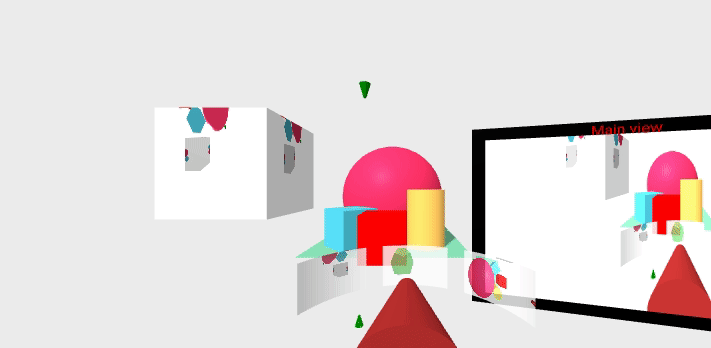

*[Back to the main page](../README.md)*

## More and more screens!

We have explored
[how to add some screens to the scene](../camrender-01/README.md),
but we can still explore this path further.
Let's add screens and cameras that move with our main camera,
multiple screens showing the same camera, and much more.

### Adding a screen to a camera

In some cases, you may need a screen that is always in your scene,
in the same relative place with respect the point of view
(which is the main camera of the scene).
A kind of a "projection on a windshell".
For obtaining this effect, I will attach a screen to the main camera.

For example, let's attach a cylindrical screen
(well, a section of a cylinder) to the main screen.
The relevant part of the scene is as follows:

```html
<a-entity position="1.5 0 3" movement-controls="fly: true; speed: 0.1; camera: #priCam">
  <a-entity id="priCam" camera position="0 1.6 0" look-controls>
    <a-cone color="brown" radius-bottom=".2" radius-top=".05" height=".5"
            position="0 -.6 -1" rotation="-80 0 0"></a-cone>
    <a-entity geometry="primitive: cylinder; radius:.7; height: .3;
                        openEnded: true; thetaStart: 135; thetaLength: 40"
              position="0 -.6 -1" material="src: #cam2; opacity: .8; side: back"></a-entity>
  </a-entity>
</a-entity>
```

You can notice that it is pretty much the same code we used for
[cameras-3](../camrender-01/README.md#cameras-3), except for the
addition of the last entity, the screen, within the main camera.
As we did before, we use the `material` component to project the canvas
that is rendering the camera (`cam2` in this case).

To avoid a minor bug in `movement-controls` (version 5.0.0, already fixed in more recent versions) we set the
`camera: #priCam"` attribute, to declare the camera we want to use 
attached to `movement-controls` (which is labeled with the same `id`, `priCam`).

The code for the secondary camera, including the canvas element in `a-assets`,
is exactly the same.

You can visit [the resulting scene in your browser](cameras-4.html),
or check its complete [source code](https://github.com/jgbarah/aframe-playground/blob/master/camrenderer-02/cameras-4.html)

The final result is like this:


### Camera linked to the main camera

Cameras can placed anywhere, including linked to the main camera.
This can be used to simulate a rear camera projecting on the windshell.

```html
<a-entity position="1.5 0 3" movement-controls="fly: true; speed: 0.1; camera: #priCam">
  <a-entity id="priCam" camera position="0 1.6 0" look-controls>
    ...
    <a-entity geometry="primitive: cylinder; radius:.7; height: .3;
                        openEnded: true; thetaStart: 195; thetaLength: 40"
              position="0 -.6 -1" material="src: #cam3; opacity: .8; side: back"></a-entity>
  </a-entity>
  <a-entity camera="active: false" camrender="cid: cam3; fps: 30"
            position="0 1.6 0" rotation="0 180 0"></a-entity>
</a-entity>
```

I just inserted the rear camera in the main camera rig,
pointing backwards. Note that this means that the camera will move
as the rig does, and therefore it is not affected by `look-controls`,
which is attached to the main camera.
This means that the rear camera will behave as a rear camera for the rig,
not for the main camera.
In other words, when you are using a headset, and move your head,
the rear camera will still point to the back of the rig
(which in this version, does never change orientation).
I also insert a screen, as we did above, for projecting this new camera.
And of course, a new canvas for it in the `a-assets` element of the scene.

Finally, I also inserted a dodecaedron in the back of the scene,
so that we can see something with the rear camera right from the start:

```html
<a-dodecahedron position="1 0.75 10" radius="2" color="lightgreen" shadow></a-dodecahedron>
```

You can visit [the resulting scene in your browser](cameras-5.html),
or check its complete [source code](https://github.com/jgbarah/aframe-playground/blob/master/camrenderer-02/cameras-5.html)

The final result is like this:


### Cameras and screens all over the place

Finally, I prepared a scene with one more camera,
this one moving, projected on two objects: a box, and one more windshell-like projection. 
The relevant code for this new camera is:

```html
<a-entity>
  <a-animation attribute="position" dur="30000"
               from="-3 -5 -6" to="3 -5 -6"
               direction="alternate" repeat="indefinite"></a-animation>
  <a-entity camera="active: false" camrender="cid: cam4"
            position="0 -0 0" rotation="90 90 0">
  </a-entity>
  <a-cone color="green" radius-bottom=".2" radius-top=".05" height=".5">
  </a-cone>
</a-entity>
```

The enclosing `a-entity` acts as a rig for the camera,
the animation that will move it, and a cone to help in visualizing where is
the camera in the scene.
The animation makes the camera (wich is set up to point upwards)
move below the scene, alternating left-to-right and right-to-left.
The position of the rig is defined by the animation within it,
and the rest of positions (for the camera and the conde) are relative to that of the rig.

That camera (rendered in the `cam4` canvas) is projected on a box,
placed at the left of the scene:

```html
<a-box position="-3 2 0" width="2" height="2" depth="2"
       material="src:#cam4"></a-box>
```

It is also projected in the "windshell", along with the two other
projections that we had (from-above and rear views), after rearranging
them a bit:

```html
<a-entity position=".5 0 5" movement-controls="fly: true; speed: 0.1; camera: #priCam">
  <a-entity id="priCam" camera camrender="cid: cam1"
            position="0 1.6 0" look-controls>
    ...
    <a-entity geometry="primitive: cylinder; radius:.7; height: .3;
                        openEnded: true; thetaStart: 105; thetaLength: 40"
              position="0 -.6 -1" material="src: #cam2; opacity: .8; side: back">
    </a-entity>
    <a-entity geometry="primitive: cylinder; radius:.7; height: .3;
                        openEnded: true; thetaStart: 205; thetaLength: 40"
              position="0 -.6 -1" material="src: #cam4; opacity: .8; side: back">
    </a-entity>
    <a-entity geometry="primitive: cylinder; radius:.7; height: .3;
                        openEnded: true; thetaStart: 155; thetaLength: 40"
              position="0 -.6 -1" material="src: #cam3; opacity: .8; side: back">
    </a-entity>
  </a-entity>
  ...
</a-entity>
```

I also improved a bit the appearance of the screen for showing the
main camera (on the right of the screen):

```html
<a-plane position="4 1 1" rotation="0 -15 0" width="4.5" height="3.5"
         material="color: black">
  <a-text position="-.3 1.56 .2" value="Main view" color="red"></a-text>
  <a-plane position="0 0 .1" width="4" height="3"
           material="src:#cam1"></a-plane>
</a-plane>
```

I used a black plane to provide some border to the screen, and then
(relative to it) the plane for projecting the camera, and some text
on the top border.

This scene, when running in the browser, is doing a good deal of computing
for rendering all the cameras. So, depending on the hardware you have,
maybe it will not update for every frame, and will take some time
to boot.

You can visit [the resulting scene in your browser](cameras-6.html),
or check its complete [source code](https://github.com/jgbarah/aframe-playground/blob/master/camrenderer-02/cameras-6.html)

The final result is like this:


