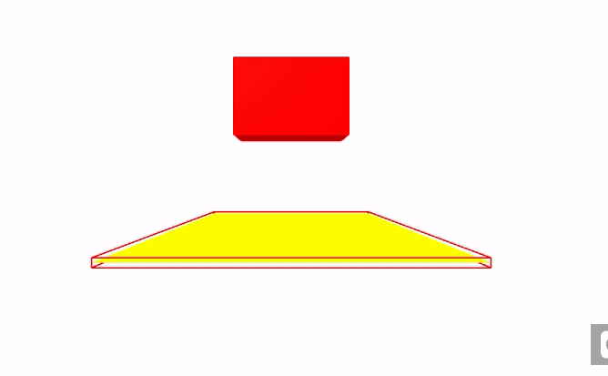

*[Back to the main page](../README.md)*

## Adding some physics

Up to now, we have completely defined the behavior of components,
usually as static bodies, or with simple movements.
But we can add some physics to the scene, so that components behave as
physical bodies: falling with gravity, bouncing when interacting with elastic bodies,
behaving to push as if bodies had mass, etc.

For all of this, we can use the [aframe-physics-system](https://github.com/donmccurdy/aframe-physics-system/)
module, which uses [Cannon.js](http://www.cannonjs.org/) behind the scenes.

### Falling boxes

When using `aframe-physics-system`, you place bodies in the scene,
and let physics control their behaviour.
For example, if you place a box in the scene, and there is gravity,
it will just fall down until something stops it (it that ever happens).

The basic components introduced by this physics module are:

* `static-body` defines an object placed in some place, which will remain static
whatever happen to it (it is not affected by gravity, nor by other bodies colliding with it),
The second

* `dynamic-body` defines an object subject to gravity, or to other bodies
colliding with it.

Let's try them, by defining a simple scena with a static plane,
and two dynamic boxes over it.

First, in the `head` element of the HTML page, we include the physics module:

```html
<head>
  ...
  <script src="http://cdn.rawgit.com/donmccurdy/aframe-physics-system/v3.3.0/dist/aframe-physics-system.min.js"></script>
</head>
```

Then, let's define the scene (not the `physics` property in the `scene` element,
so that the scene is subject to physics):

```html
<a-scene physics="debug: true">
  <a-entity camera position="0 1.6 5" look-controls wasd-controls></a-entity>
  <a-plane static-body position="0 0 -4" rotation="-90 0 0" width="8" height="8"
           color="yellow"></a-plane>
  <a-box dynamic-body position="0 4 -2" width="3" height="2" depth="1"
         color="red"></a-box>
  <a-box dynamic-body position="2 10 0" width="1" height="1" depth="1"
         color="blue"></a-box>
</a-scene>
```

The `debug: true` parameter to `physics` will produce wires around the bodies
subject to physics, which makes it easier to understand the behavior of the scene.
The rest is just placing the bodies and defining them as static or dynamic.

Watch [this scene in your browser](fall.html),
or check its complete [source code](https://github.com/jgbarah/aframe-playground/blob/master/physics-01/fall.html)

The final result is like this:



### Bodies may have impulse

There are several ways of controlling movement in a world with physics.
For example, bodies may receive impulse, and depending on the impulse vector,
it will behave by gaining velocity, and maybe impacting other bodies.

To illustrate this, we will use some JavaScript to define a new AFrame component,
`pùsh`, which will emulate "pushing" (giving some impulse) to the body.
This will happen whenever the body collides with some other in the scene,
and when that happens, it will get a "push", always in the same direction and
with the same intensity (that is, with the same impulse vector).

The new component is defined below:

```html
<script>
  AFRAME.registerComponent('push', {
    init: function() {
      var self = this;
      this.el.addEventListener("collide", function () {
        var force = new CANNON.Vec3(4, 0, 0)
        var local = new CANNON.Vec3(0, 0, 0)
        var worldVelocity = self.el.body.quaternion.vmult(force);
        self.el.body.applyImpulse(worldVelocity, local);
        console.log(self.el.body.velocity);
      });
    }
  });
</script>
```

We only needed to define a `init` function for the component,
which sets a handler for the `collide` event, which is fired by the 
physics system when bodies collide.
When this happens, the handler (second argument to `addEventListener`)
will use `CANNON` primitives to set the impulse,
and then the velocity is logged in console, to check for the change
that this impulse should have caused.

To show this new component, we define a scene with a static plane,
to "regular" dynamic boxes falling on it, and one dynamic box
(the green one), with the `push` component, which is pushed
every time it collides with the plane:

```html
<a-scene physics="debug: true">
  <a-entity camera position="0 1.6 5" look-controls wasd-controls></a-entity>
  <a-plane static-body position="0 0 -4" rotation="-90 0 0" width="16" height="12"
           color="yellow"></a-plane>
  <a-box dynamic-body position="0 4 -2" width="3" height="2" depth="1"
         color="red"></a-box>
  <a-box dynamic-body position="2 10 0" width="1" height="1" depth="1"
         color="blue"></a-box>
  <a-entity geometry="primitive: box" push dynamic-body position="-3 4 -2" width="1" height="1" depth="1"
            material="color: green"></a-entity>
</a-scene>
```

The movement is complex, and everytime you launch the scene, it
will be different (meaning that small changes to how the blue box falls
can cause it to bounce more or less times, thus pushing the red box
more or less, in some cases even pushing it out of the plane).

Watch [this scene in your browser](impulse.html),
or check its complete [source code](https://github.com/jgbarah/aframe-playground/blob/master/physics-01/impulse.html)

The final result is like this:


### Bodies with uniform velocity

Now, I will add a sphere with a uniform velocity.
I want it to run horizontally, not being affected by gravity.
For that, it is enough to make its mass equal to 0.
The element will be like this:

```html
<a-sphere explode dynamic-body="mass: 0" position="-6 2 -2" velocity="1 0 0" radius="1"
          color="blue"></a-sphere>
```

As seen, velocity is expressed using the `velocity` component.
We also use the `explode` component, which we defined earlier,
in the `head` element of the HTML page:

```html
<script>
AFRAME.registerComponent('explode', {
    init: function() {
      var self = this;
      this.el.addEventListener("collide", function () {
        self.el.parentElement.removeChild(self.el)
      });
    }
  });
</script>
```

This component will add a listener for the `collide` event,
which will remove the element from the page.

Watch [this scene in your browser](velocity.html),
or check its complete [source code](https://github.com/jgbarah/aframe-playground/blob/master/physics-01/velocity.html)

The final result is like this:

